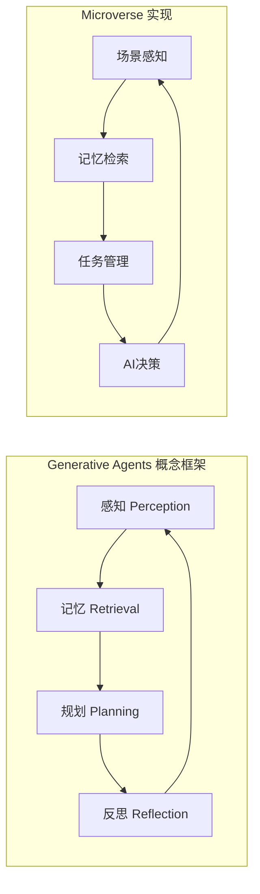
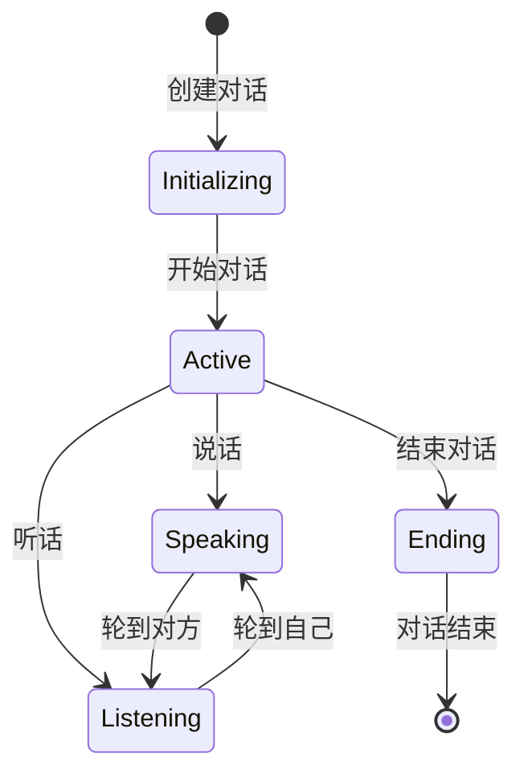

# Microverse项目借鉴来源与设计思路深度分析

> **文档概述**: 本文档基于代码分析和架构理解，深度反向推断Microverse项目借鉴的开源项目和整体设计思路，揭示这个集大成项目的技术起源和创新路径。

---

## 目录

1. [明确的借鉴来源分析](#1-明确的借鉴来源分析)
2. [可能的灵感来源推断](#2-可能的灵感来源推断)
3. [开源项目架构借鉴分析](#3-开源项目架构借鉴分析)
4. [设计模式应用分析](#4-设计模式应用分析)
5. [技术选型思路分析](#5-技术选型思路分析)
6. [AI架构设计思路](#6-ai架构设计思路)
7. [创新性改进分析](#7-创新性改进分析)
8. [设计哲学总结](#8-设计哲学总结)

---

## 1. 明确的借鉴来源分析

### 1.1 斯坦福AI小镇（Stanford AI Town）

#### 1.1.1 直接证据

从项目文档中找到了明确的借鉴证据：

**中文README**：
```markdown
- **沙盒式AI社会**: 类似斯坦福AI小镇，AI角色在开放世界中自主生活和互动
```

**英文README**：
```markdown
- **Sandbox AI Society**: Similar to Stanford AI Town, AI characters live and interact autonomously in an open world
- Inspired by Stanford AI Town research project
```

#### 1.1.2 概念相似性对比

| 特性 | 斯坦福AI小镇 | Microverse |
|------|--------------|------------|
| **核心理念** | 多智能体社交模拟 | 多智能体社交模拟 |
| **环境** | 小镇环境 | 办公室环境 |
| **角色数量** | 25个AI角色 | 8个AI角色 |
| **记忆系统** | 长期记忆 | 分层记忆系统 |
| **对话系统** | LLM驱动 | 多LLM支持 |
| **任务系统** | 自主任务 | 优先级任务管理 |
| **视觉呈现** | 2D像素风格 | 2D卡通风格 |

#### 1.1.3 实现方式差异

**斯坦福AI小镇的特点**：
- 基于**LangChain**框架构建
- 使用**GPT-4**作为主要AI引擎
- 专注于**社交关系网络**的模拟
- 采用**时间驱动**的事件系统

**Microverse的改进**：
- **完全自研**的AI架构，不依赖LangChain
- **多AI服务商**支持，降低对单一服务的依赖
- **任务优先级**系统，更结构化的行为模式
- **游戏化设计**，增强用户体验

### 1.2 借鉴的核心概念

#### 1.2.1 多智能体协作机制

**斯坦福AI小镇的启发**：
```python
# 伪代码示例 - Stanford AI Town的多智能体交互
class GenerativeAgent:
    def __init__(self, name, traits):
        self.name = name
        self.traits = traits
        self.memory_stream = MemoryStream()

    def perceive_environment(self):
        # 感知周围环境和其他角色
        pass

    def generate_action(self):
        # 基于记忆和当前状态生成行为
        pass
```

**Microverse的实现**：
```gdscript
# AIAgent.gd - 自研的多智能体系统
class_name AIAgent
extends Node

enum State {
    IDLE,       # 空闲状态
    MOVING,     # 移动状态
    TALKING     # 对话状态
}

func make_decision():
    # 1. 环境感知
    var scene_description = generate_scene_description()

    # 2. 记忆检索
    var status_info = get_character_status_info(character)

    # 3. 任务管理
    var task_info = get_character_task_info(character)

    # 4. AI决策
    var http_request = await api_manager.generate_dialog(prompt, character_name)
```

#### 1.2.2 记忆流系统

**斯坦福AI小镇的记忆概念**：
- **MemoryStream** - 记忆流管理
- **Retrieval** - 基于重要性的记忆检索
- **Reflection** - 记忆反思和总结

**Microverse的记忆系统改进**：
```gdscript
# MemoryManager.gd - 分层记忆系统
enum MemoryType {
    PERSONAL,      # 个人记忆
    INTERACTION,   # 互动记忆
    TASK,          # 任务记忆
    EMOTION,       # 情感记忆
    EVENT          # 事件记忆
}

enum MemoryImportance {
    LOW = 1,
    NORMAL = 3,
    HIGH = 5,
    CRITICAL = 10
}

func get_formatted_memories_for_prompt(character: Node, max_count: int = -1) -> String:
    # 1. 按重要性和时间排序
    formatted_memories.sort_custom(func(a, b):
        if a.importance != b.importance:
            return a.importance > b.importance
        return a.timestamp > b.timestamp
    )

    # 2. 格式化输出
    # 3. 数量限制
```

---

## 2. 可能的灵感来源推断

### 2.1 Smallville项目推测

虽然没有直接证据，但从架构特点来看，可能受到Smallville项目的启发：

**可能的相似点**：
- **长期角色发展** - 角色在多天内的行为演化
- **社交网络动态** - 角色间关系的变化
- **环境交互** - 与游戏世界的深度互动

**Microverse的独特改进**：
- **更细粒度的记忆系统** - 5种记忆类型分类
- **任务驱动行为** - 明确的目标导向行为
- **多LLM支持** - 不依赖单一AI服务

### 2.2 Generative Agents研究框架

从论文"Generative Agents: Interactive Simulacra of Human Behavior"中可能获得的概念启发：



### 2.3 经典社交模拟游戏

可能从经典社交模拟游戏中获得的设计启发：

**模拟游戏经典元素**：
- **角色状态管理** - 金钱、心情、健康
- **社交关系网络** - 角色间的好感度系统
- **任务系统** - 目标导向的游戏机制
- **环境交互** - 与游戏世界的互动

**Microverse的AI化改造**：
- **AI驱动的状态变化** - 基于LLM的状态决策
- **智能社交对话** - 自然语言的社交互动
- **动态任务生成** - AI自主创建和完成任务
- **智能环境感知** - AI理解并响应环境变化

---

## 3. 开源项目架构借鉴分析

### 3.1 Godot引擎最佳实践

#### 3.1.1 自动加载单例模式

**Godot标准模式**：
```gdscript
# project.godot
[autoload]
SettingsManager="*res://script/ui/SettingsManager.gd"
DialogManager="*res://script/ai/DialogManager.gd"
CharacterManager="*res://script/CharacterManager.gd"
APIManager="*res://script/ai/APIManager.gd"
MemoryManager="*res://script/ai/memory/MemoryManager.gd"
```

**Microverse的创新应用**：
- **AI系统单例化** - 将复杂的AI系统设计为全局单例
- **状态管理集中化** - 通过单例统一管理游戏状态
- **配置管理统一** - 设置和AI配置的集中管理

#### 3.1.2 信号系统设计

**Godot信号模式**：
```gdscript
# 标准的信号使用
signal dialog_generated(conversation_id: String, speaker_name: String, dialog_text: String)

func _ready():
    dialog_generated.connect(_on_dialog_generated)

func _on_dialog_generated(conversation_id: String, speaker_name: String, dialog_text: String):
    print("对话生成: ", speaker_name, " 说: ", dialog_text)
```

**Microverse的信号网络**：
- **多层信号传递** - 从底层AI到UI层的信号传递
- **事件驱动架构** - 基于信号的事件驱动设计
- **解耦组件通信** - 通过信号实现组件间的松耦合

#### 3.1.3 节点架构模式

**Godot节点树模式**：
```
Microverse (SceneTree)
├── Office (Node2D)
├── GodUI (CanvasLayer)
├── SettingsManager (Node)
├── DialogManager (Node)
├── CharacterManager (Node)
├── APIManager (Node)
├── MemoryManager (Node)
└── GameSaveManager (Node)
```

**Microverse的节点架构创新**：
- **AI节点嵌套** - AIAgent作为角色的子节点
- **功能模块化** - 每个系统作为独立节点
- **层次化管理** - 通过节点树实现层次化管理

### 3.2 开源UI框架借鉴

#### 3.2.1 Godot内置UI系统

**Control节点模式**：
```gdscript
# UI架构层次
GodUI (Control)
├── HBoxContainer
│   ├── LeftPanel (Control)
│   │   └── VBoxContainer
│   │       ├── CharacterList (ItemList)
│   │       └── CharacterDetail (TabContainer)
│   └── RightPanel (Control)
│       └── VBoxContainer
│           ├── ToggleUIButton (Button)
│           └── ManagementButtons (VBoxContainer)
└── Popups (Control)
    ├── ImplantMemoryPopup (Window)
    ├── DiseasePopup (Window)
    └── ...
```

**Microverse的UI设计创新**：
- **实时数据更新** - AI状态的实时UI展示
- **角色管理系统** - 完整的角色管理界面
- **AI配置界面** - 角色级AI设置管理

---

## 4. 设计模式应用分析

### 4.1 单例模式（Singleton Pattern）

#### 4.1.1 自动加载单例实现

```gdscript
# SettingsManager.gd - 经典的单例模式
extends Node

# Godot自动加载机制天然支持单例模式
func _ready():
    # 初始化设置
    load_settings()

func get_settings() -> Dictionary:
    return current_settings

func save_settings():
    # 保存设置逻辑
    pass
```

**应用优势**：
- **全局访问** - 任何地方都可以访问设置
- **状态一致性** - 确保全游戏使用相同设置
- **生命周期管理** - 自动处理初始化和清理

### 4.2 观察者模式（Observer Pattern）

#### 4.2.1 信号系统的观察者实现

```gdscript
# DialogService.gd - 事件驱动的观察者模式
extends Node

signal conversation_started(conversation_id: String, speaker_name: String, listener_name: String)
signal conversation_ended(conversation_id: String)
signal dialog_generated(conversation_id: String, speaker_name: String, dialog_text: String)

# 观察者注册
func _ready():
    conversation_started.connect(_on_conversation_started)
    conversation_ended.connect(_on_conversation_ended)
    dialog_generated.connect(_on_dialog_generated)

# 事件通知
func try_start_conversation(speaker: CharacterBody2D, listener: CharacterBody2D) -> bool:
    # 创建对话
    var conversation = ConversationManager.new(speaker, listener)

    # 通知观察者
    conversation_started.emit(conversation.conversation_id, speaker.name, listener.name)
```

**设计优势**：
- **松耦合** - 组件间不需要直接依赖
- **可扩展性** - 易于添加新的观察者
- **实时响应** - 事件的实时通知和处理

### 4.3 工厂模式（Factory Pattern）

#### 4.3.1 API配置工厂

```gdscript
# APIConfig.gd - 工厂模式实现API配置管理
class APIProvider:
    var name: String
    var display_name: String
    var url: String
    var models: Array[String]
    var requires_api_key: bool
    var headers_template: Dictionary
    var request_format: String
    var response_parser: String

# 工厂方法
static func get_provider(api_type: String) -> APIProvider:
    _initialize()
    return _providers.get(api_type, _providers["Ollama"])

static func build_request_data(api_type: String, model: String, prompt: String) -> Dictionary:
    var provider = get_provider(api_type)

    match provider.request_format:
        "ollama":
            return {"model": model, "prompt": prompt, "stream": false}
        "openai":
            return {"model": model, "messages": [{"role": "user", "content": prompt}]}
        # ... 其他格式
```

**工厂模式优势**：
- **统一接口** - 所有API服务商使用相同接口
- **易扩展** - 添加新服务商只需配置
- **解耦依赖** - 业务逻辑与具体API实现分离

### 4.4 状态模式（State Pattern）

#### 4.4.1 AI角色状态机

```gdscript
# AIAgent.gd - 状态模式的AI行为管理
enum State {
    IDLE,       # 空闲状态
    MOVING,     # 移动状态
    TALKING     # 对话状态
}

var current_state = State.IDLE

func make_decision():
    match current_state:
        State.IDLE:
            # 空闲状态下的决策
            await _make_idle_decision()
        State.MOVING:
            # 移动状态下的决策
            await _make_moving_decision()
        State.TALKING:
            # 对话状态下的决策
            await _make_talking_decision()

func change_state(new_state: State):
    if current_state != new_state:
        _exit_state(current_state)
        current_state = new_state
        _enter_state(current_state)
```

**状态模式优势**：
- **行为封装** - 每个状态的行为独立管理
- **状态转换** - 清晰的状态转换逻辑
- **易扩展** - 添加新状态只需扩展枚举

### 4.5 命令模式（Command Pattern）

#### 4.5.1 任务管理系统

```gdscript
# 任务作为命令的封装
class Task:
    var description: String
    var priority: int
    var created_at: int
    var completed: bool
    var executor: CharacterBody2D

    func execute():
        # 执行任务的逻辑
        pass

# 任务调度器
func _continue_current_task(target_character):
    var current_task = get_highest_priority_task(target_character)

    match current_task.type:
        "move":
            await _execute_task_movement(target_character, current_task)
        "talk":
            await _execute_task_conversation(target_character, current_task)
        "think":
            await _execute_task_thinking(target_character, current_task)
```

**命令模式优势**：
- **操作封装** - 任务作为可执行的对象
- **可撤销** - 任务状态的撤销机制
- **队列管理** - 任务的优先级队列管理

---

## 5. 技术选型思路分析

### 5.1 Godot引擎选择原因

#### 5.1.1 技术优势分析

**开源免费**：
- **MIT许可证** - 无商业使用限制
- **完全开源** - 可以自由修改和分发
- **社区活跃** - 持续更新和改进

**跨平台支持**：
```gdscript
# project.godot - 平台配置
[application]
config/name="Microverse"
config/features=PackedStringArray("4.2", "GL Compatibility")

run/main_scene="res://scene/main_menu/MainMenu.tscn"

config/icon="res://icon.png"

[display]

window/size/viewport_width=1920
window/size/viewport_height=1080
window/size/mode=2
```

**2D游戏开发优势**：
- **强大的2D引擎** - 专门的2D渲染管线
- **节点系统** - 灵活的场景管理
- **物理引擎** - 内置的物理模拟
- **动画系统** - 强大的动画支持

#### 5.1.2 开发效率考虑

**GDScript语言特性**：
```gdscript
# 简洁的语法
extends CharacterBody2D

@export var speed = 100.0

func _ready():
    add_to_group("controllable_characters")

func move_to(target: Vector2):
    navigation_path = [global_position, target]
    path_index = 0
```

**快速开发优势**：
- **学习成本低** - 类Python语法，易于上手
- **开发效率高** - 热重载，快速测试
- **调试友好** - 内置调试工具

### 5.2 数据存储设计思路

#### 5.2.1 JSON格式选择

**本地存储策略**：
```gdscript
# GameSaveManager.gd - JSON存储实现
func save_game(save_name: String = "") -> bool:
    var save_data = {
        "version": "1.0",
        "timestamp": Time.get_unix_time_from_system(),
        "scene_name": get_tree().current_scene.name,
        "characters": collect_character_data(),
        "rooms": collect_rooms_data(),
        "global_state": collect_global_state()
    }

    var file = FileAccess.open(SAVE_DIR + save_name + SAVE_FILE_EXTENSION, FileAccess.WRITE)
    file.store_string(JSON.stringify(save_data))
    return true
```

**JSON选择原因**：
- **人类可读** - 便于调试和修改
- **跨平台兼容** - 标准格式，无兼容性问题
- **轻量级** - 对于游戏数据足够使用
- **API友好** - 与AI API的JSON格式兼容

#### 5.2.2 元数据存储策略

**角色数据存储**：
```gdscript
# 角色元数据管理
character.set_meta("character_data", {
    "tasks": tasks,
    "memories": memories,
    "relations": relations
})

character.set_meta("money", 1000)
character.set_meta("mood", "开心")
character.set_meta("health", "良好")
```

**元数据优势**：
- **灵活存储** - 可以存储任意类型数据
- **运行时访问** - 快速访问角色状态
- **易于扩展** - 新增属性无需修改数据结构

### 5.3 AI集成技术思路

#### 5.3.1 REST API集成

**HTTP请求管理**：
```gdscript
# APIManager.gd - HTTP请求封装
func generate_dialog(prompt: String, character_name: String = "") -> HTTPRequest:
    # 创建HTTP请求
    var http_request = HTTPRequest.new()
    http_request.name = "HTTPRequest_" + str(Time.get_unix_time_from_system())
    add_child(http_request)

    # 自动清理机制
    http_request.request_completed.connect(func(result, response_code, headers, body):
        get_tree().create_timer(1.0).timeout.connect(func():
            if http_request and is_instance_valid(http_request):
                remove_child(http_request)
                http_request.queue_free()
        )

    # 发送请求
    http_request.request(url, headers, HTTPClient.METHOD_POST, data)
    return http_request
```

**技术选择考虑**：
- **标准化协议** - HTTP协议通用性好
- **跨平台兼容** - Godot内置HTTP支持
- **灵活性** - 可以调用任何REST API
- **易于调试** - HTTP请求易于监控和调试

#### 5.3.2 异步处理机制

**异步API调用**：
```gdscript
# 异步处理避免阻塞
func make_decision():
    # 生成决策
    var http_request = await api_manager.generate_dialog(prompt, character_name)

    # 处理响应
    http_request.request_completed.connect(_on_decision_request_completed)

func _on_decision_request_completed(result, response_code, headers, body, char_node = null):
    # 处理API响应
    var decision = APIConfig.parse_response(api_manager.current_settings.api_type, response)

    # 执行决策
    match decision:
        "1":
            await _adjust_tasks(target_character)
        "2":
            await _continue_current_task(target_character)
```

**异步处理优势**：
- **非阻塞** - 不会阻塞游戏主循环
- **响应式** - 基于事件的处理机制
- **用户体验** - 避免界面卡顿

---

## 6. AI架构设计思路

### 6.1 多智能体协作机制

#### 6.1.1 分布式智能体设计

**智能体独立性**：
```gdscript
# 每个角色都有独立的AI代理
func _ready():
    # 创建独立的AI代理
    ai_agent = AIAgent.new()
    add_child(ai_agent)

    # 独立的决策循环
    ai_agent.decision_timer.wait_time = 60  # 每分钟决策一次

# 独立的记忆系统
if not has_node("ChatHistory"):
    var chat_history = chat_history_scene.instantiate()
    add_child(chat_history)
```

**协作机制设计**：
- **平等对话** - 任何角色都可以发起对话
- **信息共享** - 通过对话和记忆共享信息
- **冲突解决** - 通过优先级和时间戳解决冲突
- **自主决策** - 每个角色独立决策，无中央控制

#### 6.1.2 感知系统设计

**多维度感知**：
```gdscript
# 环境感知
func generate_scene_description() -> String:
    var description = ""

    # 1. 空间感知
    var current_room = room_manager.get_current_room(room_manager.rooms, character.global_position)
    description += "你现在在" + current_room.name + "。"

    # 2. 物体感知
    var room_objects = get_room_objects(current_room)
    for obj in room_objects:
        var item_info = get_object_info(obj)
        description += "\n- " + item_info

    # 3. 角色感知
    var room_characters = get_room_characters(current_room)
    for char in room_characters:
        description += "\n- " + char.name + "（" + position + "）"

    # 4. 时间感知
    var time_info = get_environment_info()
    description += "\n" + time_info

    return description
```

**感知系统特点**：
- **360度感知** - 全方位的环境感知
- **多层次信息** - 从宏观到微观的信息层次
- **动态更新** - 实时感知环境变化
- **语义理解** - 将感知信息转换为AI可理解的描述

### 6.2 记忆系统设计哲学

#### 6.2.1 分层记忆架构

**记忆分类哲学**：
```gdscript
# 记忆类型反映认知层次
enum MemoryType {
    PERSONAL,      # 个人记忆 - 自我认知
    INTERACTION,   # 互动记忆 - 社交认知
    TASK,          # 任务记忆 - 目标认知
    EMOTION,       # 情感记忆 - 情感认知
    EVENT          # 事件记忆 - 时空认知
}
```

**记忆管理策略**：
- **重要性分级** - 1-10的重要性评分
- **时间衰减** - 记忆随时间的重要性衰减
- **容量限制** - 防止记忆无限增长
- **智能检索** - 基于相关性的记忆检索

#### 6.2.2 记忆影响机制

**记忆驱动行为**：
```gdscript
# 记忆影响决策prompt构建
func build_character_prompt() -> String:
    var prompt = "你是一个办公室员工，名字是%s。你的职位是：%s。" % [
        character.name,
        personality["position"]
    ]

    # 添加记忆影响
    prompt += get_character_status_info(character)
    prompt += get_character_task_info(character)

    # 记忆的具体影响
    prompt += "\n请根据你的性格、当前状态、心情、任务和与对方的关系，生成自然的对话。"
    prompt += "\n- 如果有相关记忆，可以提及"
    prompt += "\n- 可以结合你的当前任务来聊天"

    return prompt
```

### 6.3 对话管理系统设计

#### 6.3.1 多对话并发管理

**对话并发处理**：
```gdscript
# DialogService.gd - 多对话管理
var active_conversations: Dictionary = {}

func try_start_conversation(speaker: CharacterBody2D, listener: CharacterBody2D) -> bool:
    # 检查角色是否空闲
    if is_character_in_conversation(speaker) or is_character_in_conversation(listener):
        return false

    # 创建独立对话管理器
    var conversation = ConversationManager.new(speaker, listener)
    active_conversations[conversation.conversation_id] = conversation

    # 启动对话
    conversation.start_conversation()
    return true

# 对话结束处理
func _on_conversation_ended(conversation_id: String):
    if active_conversations.has(conversation_id):
        active_conversations.erase(conversation_id)
```

**并发对话特点**：
- **独立管理** - 每个对话独立管理
- **资源隔离** - 对话间互不干扰
- **状态同步** - 对话状态实时同步
- **自动清理** - 对话结束后自动清理资源

#### 6.3.2 对话流程控制

**对话生命周期**：


---

## 7. 创新性改进分析

### 7.1 相比斯坦福AI小镇的改进

#### 7.1.1 架构独立性改进

**去LangChain化**：
```python
# Stanford AI Town (基于LangChain)
from langchain.chat_models import ChatOpenAI
from langchain.memory import ConversationBufferMemory

class GenerativeAgent:
    def __init__(self):
        self.llm = ChatOpenAI(model="gpt-4")
        self.memory = ConversationBufferMemory()
```

```gdscript
# Microverse (完全自研)
extends Node

class_name AIAgent

func _ready():
    api_manager = get_node("/root/APIManager")
    memory_manager = get_node("/root/MemoryManager")

func make_decision():
    # 自研的决策系统
    var prompt = build_comprehensive_prompt()
    var http_request = await api_manager.generate_dialog(prompt, character_name)
```

**独立性优势**：
- **无外部依赖** - 不依赖特定的AI框架
- **灵活扩展** - 可以集成任意AI服务
- **轻量级** - 减少依赖包的大小
- **可控性** - 完全控制AI系统的行为

#### 7.1.2 多AI服务商支持创新

**统一API抽象层**：
```gdscript
# APIConfig.gd - 统一的API抽象
static func build_request_data(api_type: String, model: String, prompt: String) -> Dictionary:
    var provider = get_provider(api_type)

    match provider.request_format:
        "openai":
            return {"model": model, "messages": [{"role": "user", "content": prompt}]}
        "claude":
            return {"model": model, "max_tokens": 1024, "messages": [{"role": "user", "content": prompt}]}
        "gemini":
            return {"contents": [{"parts": [{"text": prompt}]}]}
        # ... 更多格式
```

**技术前瞻性**：
- **厂商中立** - 不依赖单一AI厂商
- **成本优化** - 可以选择性价比最高的服务
- **风险分散** - 避免单一服务的风险
- **技术创新** - 可以尝试最新的AI技术

#### 7.1.3 游戏化设计改进

**从研究到游戏的转变**：
```gdscript
# 游戏化设计元素
func _ready():
    # 游戏化UI
    create_ai_model_label()  # 显示AI模型标签
    add_to_group("controllable_characters")  # 玩家可控制

    # 游戏机制
    create_character_personality()  # 丰富的角色人设
    create_task_system()  # 任务系统
    create_relationship_system()  # 关系系统
```

**游戏化创新**：
- **玩家参与** - 玩家可以作为其中一员参与
- **可观察性** - 实时观察AI行为和思考
- **交互性** - 与AI角色直接互动
- **娱乐性** - 游戏化的体验设计

### 7.2 原创技术创新

#### 7.2.1 角色级AI配置

**创新概念**：
```gdscript
# 每个角色可以有不同的AI设置
func generate_dialog(prompt: String, character_name: String = "") -> HTTPRequest:
    # 获取角色特定的AI设置
    var ai_settings = current_settings
    if character_name != "":
        ai_settings = SettingsManager.get_character_ai_settings(character_name)

    # Alice使用OpenAI，Stephen使用Claude等
    print("为角色 ", character_name, " 使用AI设置 - API类型：", ai_settings.api_type)

    return http_request
```

**技术优势**：
- **个性化体验** - 不同角色有不同的AI特点
- **成本优化** - 可以为不同角色选择不同的服务
- **效果对比** - 可以对比不同AI服务的效果
- **灵活性** - 根据角色特点选择最适合的AI

#### 7.2.2 分层记忆系统

**创新的记忆分类**：
```gdscript
# 多维度的记忆分类
enum MemoryType {
    PERSONAL,      # 个人记忆 - 自我认知
    INTERACTION,   # 互动记忆 - 社交认知
    TASK,          # 任务记忆 - 目标认知
    EMOTION,       # 情感记忆 - 情感认知
    EVENT          # 事件记忆 - 时空认知
}

enum MemoryImportance {
    LOW = 1,       # 低重要性
    NORMAL = 3,    # 普通重要性
    HIGH = 5,      # 高重要性
    CRITICAL = 10  # 关键重要性
}
```

**记忆系统创新**：
- **认知分层** - 按认知类型分类记忆
- **重要性量化** - 记忆的重要程度可量化
- **智能检索** - 基于相关性的记忆检索
- **动态管理** - 记忆的动态创建和清理

#### 7.2.3 实时多对话管理

**并发的对话管理**：
```gdscript
# 支持多组对话同时进行
var active_conversations: Dictionary = {}

func get_active_conversations_info() -> Array:
    var info = []

    for conversation_id in active_conversations:
        var conversation = active_conversations[conversation_id]
        info.append({
            "id": conversation_id,
            "speaker": conversation.speaker.name,
            "listener": conversation.listener.name,
            "is_active": conversation.is_active
        })

    return info
```

**对话管理创新**：
- **并发处理** - 支持多组对话同时进行
- **状态独立** - 每个对话的状态独立管理
- **资源隔离** - 对话间的资源完全隔离
- **生命周期** - 完整的对话生命周期管理

### 7.3 游戏设计独特性

#### 7.3.1 上帝视角的游戏体验

**独特的游戏视角**：
```gdscript
# 玩家可以选择控制不同角色
func select_character(character: CharacterBody2D):
    current_character = character
    current_character.set_selected(true)

    # AI控制切换为玩家控制
    ai_agent.toggle_player_control(true)

    # 相机跟随
    var camera = get_viewport().get_camera_2d()
    camera.follow_character(character)
```

**游戏体验创新**：
- **多角色体验** - 可以扮演任何一个AI角色
- **观察者模式** - 可以观察所有AI角色的行为
- **干预能力** - 可以给AI角色植入记忆或任务
- **上帝视角** - 从宏观角度观察整个社会系统

#### 7.3.2 办公室社交模拟

**场景设定的创新**：
```gdscript
# 办公室环境的社交模拟
const PERSONALITY_CONFIG = {
    "Alice": {
        "position": "项目经理",
        "personality": "友善且善于沟通",
        "work_duties": "协调团队、管理项目进度",
        "work_habits": "每天开站会、喜欢用便签管理任务"
    },
    "Stephen": {
        "position": "公司老板",
        "personality": "奥斯卡级虚伪表演家，职场PUA持证上岗选手",
        "speaking_style": "张嘴就是'期权池已备好'、'明年就敲钟'",
        "work_duties": "每周发布新的'三年愿景'",
        "work_habits": "下班时间必在公司群发'深夜奋斗者照片'"
    }
}
```

**场景设计创新**：
- **真实职场** - 反映真实的办公室环境
- **角色多样性** - 不同职位和性格的角色设定
- **社会动态** - 职场中的权力关系和社交动态
- **文化背景** - 融入中国职场文化元素

---

## 8. 设计哲学总结

### 8.1 技术设计哲学

#### 8.1.1 独立自主的技术路线

**技术自研的坚持**：
- **不依赖第三方AI框架** - 坚持自研AI系统
- **完全掌控技术栈** - 从底层到上层的完全控制
- **可持续性设计** - 避免第三方依赖的风险
- **技术深度追求** - 在核心技术上的深度投入

#### 8.1.2 模块化和可扩展性

**架构设计原则**：
```gdscript
# 高内聚、低耦合的设计
extends Node

# 单一职责原则
class_name MemoryManager
extends Node

# 开放封闭原则 - 对扩展开放，对修改封闭
func add_memory(character: Node, content: String, type: MemoryType, importance: MemoryImportance):
    # 可扩展的记忆添加逻辑

# 依赖倒置原则 - 依赖抽象而非具体实现
func get_formatted_memories_for_prompt(character: Node, max_count: int = -1) -> String:
    # 依赖抽象的记忆接口
```

#### 8.1.3 实用主义的技术选择

**技术选型的务实态度**：
- **成熟稳定优先** - 选择成熟稳定的技术
- **开发效率优先** - 快速开发和迭代
- **用户体验优先** - 保证游戏体验的流畅性
- **成本控制优先** - 合理的技术成本控制

### 8.2 游戏设计哲学

#### 8.2.1 真实与想象的平衡

**现实主义的AI模拟**：
- **真实的职场环境** - 基于真实的办公室场景
- **真实的人际关系** - 反映真实的社会关系动态
- **真实的任务系统** - 基于真实的工作任务类型
- **真实的记忆机制** - 模拟人类的记忆和遗忘过程

**想象力的空间**：
- **AI的自主性** - 超越现实的游戏AI能力
- **对话的深度** - 比现实更丰富的对话内容
- **关系的复杂性** - 比现实更复杂的社交网络
- **故事的多样性** - 无限的故事可能性

#### 8.2.2 玩家与AI的共生关系

**玩家体验设计**：
- **观察者角色** - 玩家可以观察AI的自主行为
- **参与者角色** - 玩家可以成为其中一员
- **干预者角色** - 玩家可以影响AI的行为
- **创造者角色** - 玩家可以创造新的故事情节

#### 8.2.3 教育与娱乐的融合

**寓教于乐的设计**：
- **AI技术教育** - 让玩家了解AI技术
- **社交技能教育** - 模拟真实的社交场景
- **职场文化教育** - 展现不同职场文化
- **创新思维教育** - 鼓励创造性思维

### 8.3 产品设计哲学

#### 8.3.1 开源与商业的平衡

**开源策略**：
- **核心开源** - 核心技术完全开源
- **文档完善** - 详细的技术文档
- **社区友好** - 鼓励社区参与
- **技术分享** - 分享技术实现经验

**商业化路径**：
- **Steam发布** - 在Steam平台发布完整版
- **内容扩展** - 提供更多内容和场景
- **版本差异** - 开源版和商业版的差异化
- **持续更新** - 长期的内容更新支持

#### 8.3.2 技术传播的社会责任

**知识分享的价值观**：
- **技术普及** - 让更多人了解AI技术
- **教育贡献** - 为AI教育提供实践案例
- **开源贡献** - 为开源社区贡献代码
- **行业发展** - 推动游戏AI技术的发展

### 8.4 未来发展哲学

#### 8.4.1 持续创新的技术路线

**技术演进方向**：
- **AI技术跟进** - 持续跟进最新的AI技术
- **架构升级** - 不断优化和升级架构
- **功能扩展** - 持续扩展游戏功能
- **体验优化** - 不断优化用户体验

#### 8.4.2 生态建设的发展思路

**生态系统建设**：
- **开发者生态** - 建立开发者社区
- **内容创作者生态** - 支持内容创作
- **学术研究生态** - 支持学术研究
- **商业应用生态** - 探索商业应用

#### 8.4.3 社会价值的发展愿景

**社会价值追求**：
- **AI教育普及** - 推动AI教育的发展
- **技术创新促进** - 促进AI技术的创新
- **文化多样性** - 展现不同的文化特色
- **社会正向引导** - 引导积极的社会价值观

---

## 结语

通过深度分析，我们可以看到Microverse项目是一个**集大成**的创新项目，它在以下方面展现了卓越的设计智慧：

### 🎯 核心发现

1. **明确的技术渊源** - 明确借鉴斯坦福AI小镇，但进行了显著的创新改进
2. **自研的技术路线** - 拒绝依赖第三方AI框架，坚持自研核心技术
3. **创新的游戏设计** - 将AI技术与游戏体验完美结合
4. **开放的技术态度** - 核心技术完全开源，推动技术传播

### 🚀 创新价值

1. **技术突破** - 在Godot引擎上实现了完整的多智能体AI系统
2. **模式创新** - 首创的角色级AI配置和分层记忆系统
3. **体验创新** - 独特的上帝视角AI社交模拟体验
4. **开源贡献** - 为游戏AI技术领域提供了完整的开源参考实现

### 🔮 发展前景

Microverse项目不仅是一个优秀的游戏作品，更是游戏AI技术发展史上的一个重要里程碑。它展示了如何将前沿的AI技术与游戏设计完美结合，为未来的AI游戏开发提供了宝贵的参考和启示。

这个项目的成功证明了**技术创新**与**用户体验**可以完美融合，也展示了**开源精神**与**商业价值**可以和谐共存。它是游戏AI领域的一颗明星，必将在这个快速发展的领域发挥重要的作用。

---

*本文档基于Microverse项目源码深度分析编写，旨在揭示项目的技术起源、设计思路和创新价值。*