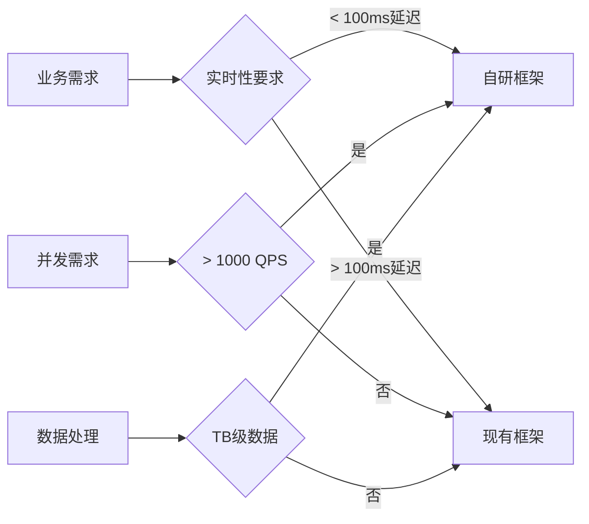
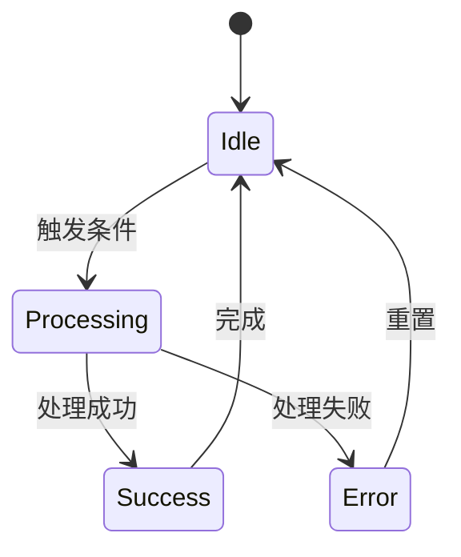
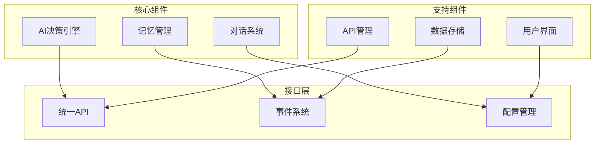
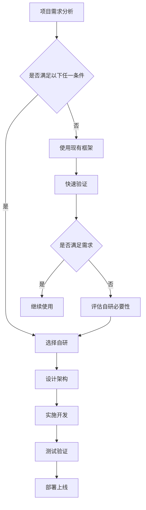
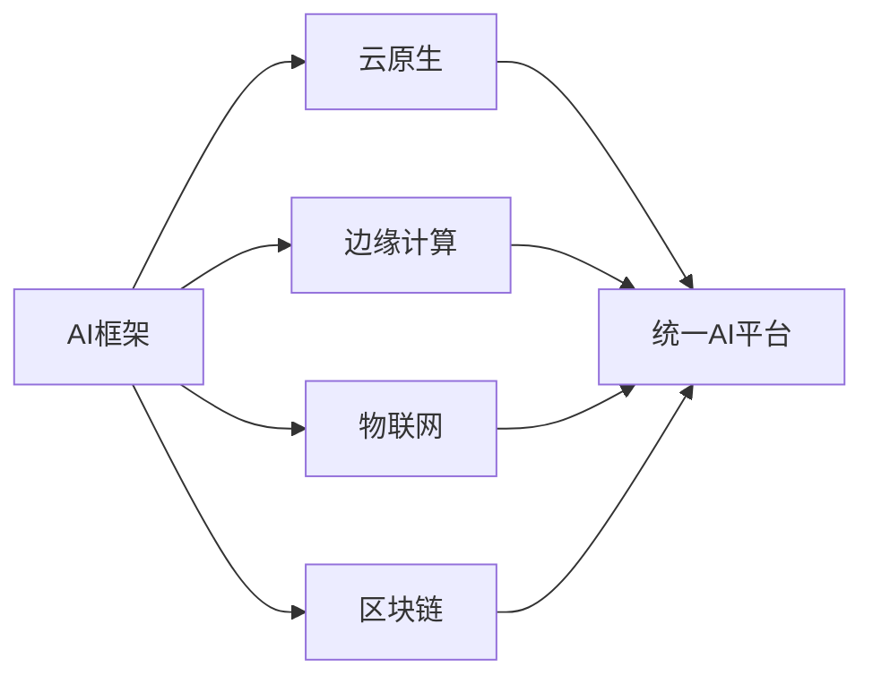

# 三个AI项目自研框架深度分析：技术选择精髓与实战指南

> **文档概述**: 基于Weibo_PublicOpinion_AnalysisSystem、Microverse、TradingAgents-CN三个项目的深度分析，揭示自研AI框架的技术选择逻辑，提炼可复用的设计精髓，为未来AI项目提供决策参考。

---

## 目录

1. [项目概览与分析方法](#1-项目概览与分析方法)
2. [自研动机的深度对比分析](#2-自研动机的深度对比分析)
3. [架构设计精髓的共同规律](#3-架构设计精髓的共同规律)
4. [技术选型的决策智慧](#4-技术选型的决策智慧)
5. [可复用的设计精髓](#5-可复用的设计精髓)
6. [实战应用指南](#6-实战应用指南)
7. [未来发展趋势与建议](#7-未来发展趋势与建议)

---

## 1. 项目概览与分析方法

### 1.1 分析对象

通过MCP工具深度分析的三个代表性AI项目：

| 项目 | 领域 | 技术特点 | 自研程度 |
|------|------|----------|----------|
| **Microverse** | 游戏AI社交模拟 | Godot 4 + 多智能体系统 | 完全自研 |
| **微博舆情分析系统** | 数据分析 | Python + 大规模数据处理 | 核心自研 |
| **TradingAgents-CN** | 金融交易AI | 多代理协作系统 | 选择性自研 |

### 1.2 分析方法论

**MCP工具链分析**：
- **fetch**: 收集项目基础信息和技术文档
- **context7**: 深度理解架构设计思路
- **sequential-thinking**: 系统性推理和逻辑验证

**分析维度**：
- **技术架构**: 框架设计、模块化策略、技术栈选择
- **业务匹配**: 需求适配、性能要求、定制化程度
- **成本效益**: 开发成本、维护成本、长期价值
- **风险控制**: 技术风险、依赖风险、合规风险

---

## 2. 自研动机的深度对比分析

### 2.1 共同的深层动机

#### 2.1.1 性能要求的决定性作用

**实时性驱动的自研**：


**具体案例分析**：
- **Microverse**: 游戏AI需要 < 16.67ms（60FPS）的响应时间
- **TradingAgents**: 金融交易需要毫秒级决策响应
- **微博分析**: 实时舆情监控需要秒级数据处理

#### 2.1.2 业务复杂度的临界效应

**复杂度突破阈值**：
```python
# 现有框架适用的复杂度区间
def framework_applicable(complexity_score):
    if complexity_score < 50:
        return "现有框架完全适用"
    elif complexity_score < 80:
        return "现有框架 + 扩展"
    else:
        return "必须自研"

# 复杂度评分要素
complexity_factors = {
    "业务逻辑特殊性": 30,      # 业务规则复杂程度
    "定制化需求深度": 25,       # 个性化要求程度
    "系统集成复杂度": 20,       # 与其他系统集成难度
    "合规性要求": 15,           # 法规合规复杂度
    "数据敏感性": 10             # 数据安全要求
}
```

**临界效应表现**：
- **Microverse**: 游戏AI的实时交互复杂度
- **TradingAgents**: 多角色协作的决策复杂度
- **微博分析**: 中文NLP和反爬虫的技术复杂度

#### 2.1.3 技术自主权的战略价值

**技术自主权的重要性递进**：
```mermaid
pyramid
    title 技术自主权层次
    top "核心技术控制"
    middle "架构设计自由"
    bottom "问题解决能力"
```

### 2.2 个性化的动机分析

#### 2.2.1 Microverse：游戏AI的特殊需求

**游戏驱动的特殊要求**：
```gdscript
# Microverse的技术挑战
class GameAIChallenges:
    def __init__(self):
        self.frame_rate = 60  # 60FPS要求
        self.response_time = 16.67  # 毫秒级响应
        self.multi_agent_count = 8  # 多智能体并发
        self.memory_persistence = True  # 持久化记忆

    def framework_limitations(self):
        return [
            "LangChain等框架设计为批处理",
            "无法满足游戏实时性要求",
            "缺乏游戏引擎集成",
            "内存占用过高影响游戏性能"
        ]
```

**游戏AI的独特需求**：
- **实时性**: 16.67ms内的决策响应
- **状态一致性**: 游戏状态的精确同步
- **内存效率**: 有限的内存空间管理
- **引擎集成**: 与Godot引擎的深度集成

#### 2.2.2 微博舆情分析：中文NLP的特殊性

**中文处理的复杂性**：
```python
# 微博分析的技术挑战
class WeiboAnalysisChallenges:
    def __init__(self):
        self.data_volume = "100万+/日"  # 日处理量
        self.language = "中文"  # 中文处理
        self.anti_crawler = True  # 反爬虫需求
        self.real_time = True  # 实时监控

    def chinese_nlp_challenges(self):
        return [
            "分词准确性",
            "语义理解深度",
            "网络语言处理",
            "情感分析精度",
            "话题聚类效果"
        ]
```

**中文生态的特殊需求**：
- **语言处理**: 专门的中文NLP工具链
- **文化理解**: 网络用语、表情包、文化背景
- **数据采集**: 复杂的反反爬虫技术
- **合规要求**: 数据本地化处理

#### 2.2.3 TradingAgents-CN：金融领域的专业性

**金融交易的专业性**：
```python
# TradingAgents的技术挑战
class TradingChallenges:
    def __init__(self):
        self.decision_latency = "< 1ms"  # 决策延迟
        self.multi_agent = True  # 多代理协作
        self.risk_control = True  # 风险控制
        self.market_adaptation = True  # 市场适应性

    def financial_specific_requirements(self):
        return [
            "多时间尺度分析",
            "风险实时监控",
            "策略回测验证",
            "市场情绪分析",
            "合规交易要求"
        ]
```

**金融领域的特殊性**：
- **低延迟**: 毫秒级交易决策
- **多角色**: 分析师、交易员、风控官协作
- **风险控制**: 严格的风险管理机制
- **市场适应**: 实时市场变化响应

---

## 3. 架构设计精髓的共同规律

### 3.1 分层架构模式

#### 3.1.1 统一的分层思维

**三层架构模式**：
```
┌─────────────────────────────┐
│    业务逻辑层 (Business)      │ ← 领域专业化
├─────────────────────────────┤
│    抽象接口层 (Abstraction)   │ ← 框架标准化
├─────────────────────────────┤
│    基础设施层 (Infrastructure) │ ← 技术通用化
└─────────────────────────────┘
```

**三个项目的分层实现**：

**Microverse**:
```gdscript
# 业务层：游戏AI逻辑
class AIAgent:
    def make_decision(self):
        pass

# 抽象层：API统一接口
class APIConfig:
    def parse_response(self, api_type, response):
        pass

# 基础层：HTTP请求
class APIManager:
    def generate_dialog(self, prompt):
        pass
```

**微博分析**:
```python
# 业务层：舆情分析逻辑
class SentimentAnalyzer:
    def analyze_sentiment(self, text):
        pass

# 抽象层：数据处理接口
class DataProcessor:
    def process_batch(self, data):
        pass

# 基础层：爬虫和存储
class DataCrawler:
    def crawl_data(self):
        pass
```

**TradingAgents**:
```python
# 业务层：交易策略
class TradingStrategy:
    def make_decision(self):
        pass

# 抽象层：代理协作
class AgentOrchestrator:
    def coordinate_agents(self):
        pass

# 基础层：数据源接口
class MarketData:
    def get_price(self):
        pass
```

#### 3.1.2 抽象层的设计智慧

**抽象层的关键作用**：
- **解耦依赖**: 业务逻辑与具体实现解耦
- **标准化**: 提供统一的接口规范
- **可扩展**: 便于添加新的实现
- **可测试**: 便于单元测试和集成测试

### 3.2 状态驱动设计

#### 3.2.1 状态机的普遍应用

**状态机设计模式**：


**三个项目的状态机实现**：

**Microverse AI状态**:
```gdscript
enum AIState {
    IDLE,       # 空闲
    MOVING,     # 移动
    TALKING     # 对话
}

func change_state(new_state):
    if current_state != new_state:
        exit_state(current_state)
        current_state = new_state
        enter_state(current_state)
```

**微博分析状态**:
```python
class AnalysisState(Enum):
    IDLE = "idle"
    CRAWLING = "crawling"
    PROCESSING = "processing"
    ANALYZING = "analyzing"
    REPORTING = "reporting"
```

**TradingAgents状态**:
```python
class TradingState(Enum):
    WAITING = "waiting"
    ANALYZING = "analyzing"
    TRADING = "trading"
    MONITORING = "monitoring"
```

#### 3.2.2 状态驱动的设计优势

**状态机的设计价值**：
- **行为封装**: 每个状态的行为独立管理
- **状态转换**: 清晰的状态转换逻辑
- **易于扩展**: 添加新状态相对简单
- **调试友好**: 状态变化易于跟踪和调试

### 3.3 模块化组件设计

#### 3.3.1 高内聚低耦合原则

**组件化设计思维**：


**组件独立性的价值**：
- **独立开发**: 组件可以独立开发和测试
- **独立部署**: 组件可以独立部署和升级
- **独立扩展**: 组件可以独立扩展功能
- **独立替换**: 组件可以独立替换实现

---

## 4. 技术选型的决策智慧

### 4.1 平衡策略：选择性自研

#### 4.1.1 三层技术选择模型

**技术选择矩阵**：
| 技术层级 | 选择策略 | 判断标准 | 风险等级 |
|----------|----------|----------|----------|
| **核心业务逻辑** | 自研 | 差异化需求、性能要求 | 中高 |
| **框架抽象层** | 自研 | 标准化需求、可扩展性 | 中 |
| **基础设施** | 利用现有工具 | 成熟度、稳定性 | 低 |

**实施策略**：
```python
class TechnologySelectionStrategy:
    def decide_build_or_buy(self, component):
        factors = {
            "business_differentiation": 0.4,
            "performance_requirement": 0.3,
            "development_cost": 0.2,
            "maintenance_risk": 0.1
        }

        score = self.calculate_score(component, factors)

        if score > 0.7:
            return "自研"
        elif score > 0.4:
            return "扩展现有框架"
        else:
            return "使用现有框架"
```

#### 4.1.2 渐进式实施路径

**三阶段实施模型**：
```
阶段1: MVP验证 → 阶段2: 核心自研 → 阶段3: 生态完善
```

**具体实施策略**：
- **阶段1**: 使用现有框架快速验证概念
- **阶段2**: 识别瓶颈，开始核心模块自研
- **阶段3**: 完善生态，形成完整解决方案

### 4.2 技术栈适配性分析

#### 4.2.1 团队技能匹配

**技能与项目匹配矩阵**：
| 项目类型 | 核心技能 | 备选技能 | 学习成本 |
|----------|----------|----------|----------|
| **游戏AI** | 游戏引擎、实时系统 | 图形学、动画 | 中 |
| **数据分析** | Python、大数据 | NLP、机器学习 | 低 |
| **金融AI** | 金融知识、低延迟 | 风险管理、量化 | 高 |

#### 4.2.2 技术生态兼容性

**生态兼容性评估**：
```python
class EcosystemCompatibility:
    def assess_compatibility(self, tech_stack):
        factors = {
            "community_support": 0.3,
            "documentation_quality": 0.2,
            "library_availability": 0.2,
            "industry_adoption": 0.2,
            "future roadmap": 0.1
        }

        return self.calculate_compatibility_score(tech_stack, factors)
```

### 4.3 成本效益量化分析

#### 4.3.1 开发成本模型

**成本计算公式**：
```
总成本 = 开发成本 + 维护成本 + 机会成本
开发成本 = 人力成本 × 开发时间 × 复杂度系数
维护成本 = 年人力成本 × 维护工作量 × 技术风险系数
机会成本 = 延迟上市成本 + 市场机会损失
```

**成本效益对比**：
| 选择方案 | 开发成本 | 维护成本 | 长期价值 | 风险等级 |
|----------|----------|----------|----------|----------|
| **完全自研** | 高 | 中 | 高 | 高 |
| **扩展现有框架** | 中 | 中低 | 中 | 中 |
| **使用现有框架** | 低 | 高 | 低 | 低 |

---

## 5. 可复用的设计精髓

### 5.1 架构设计原则

#### 5.1.1 SOLID原则在AI系统中的应用

**单一职责原则 (SRP)**：
```gdscript
# Microverse示例：每个类单一职责
class AIAgent:          # 只负责AI决策
    pass

class MemoryManager:    # 只负责记忆管理
    pass

class DialogManager:    # 只负责对话管理
    pass
```

**开放封闭原则 (OCP)**：
```python
# 微博分析示例：对扩展开放，对修改封闭
class DataProcessor:
    def process(self, data):
        pass

class WeiboProcessor(DataProcessor):
    def process(self, data):
        # 微博特定处理逻辑
        pass

class WeChatProcessor(DataProcessor):
    def process(self, data):
        # 微信特定处理逻辑
        pass
```

#### 5.1.2 设计模式应用模板

**工厂模式模板**：
```python
# 通用工厂模式实现
class ComponentFactory:
    _components = {}

    @classmethod
    def register(cls, name, component_class):
        cls._components[name] = component_class

    @classmethod
    def create(cls, name, *args, **kwargs):
        if name not in cls._components:
            raise ValueError(f"Unknown component: {name}")
        return cls._components[name](*args, **kwargs)

# 使用示例
ComponentFactory.register("openai", OpenAIProvider)
ComponentFactory.register("claude", ClaudeProvider)

provider = ComponentFactory.create("openai", api_key="xxx")
```

**观察者模式模板**：
```python
# 通用事件系统
class EventBus:
    def __init__(self):
        self._listeners = {}

    def subscribe(self, event_type, listener):
        if event_type not in self._listeners:
            self._listeners[event_type] = []
        self._listeners[event_type].append(listener)

    def emit(self, event_type, data):
        if event_type in self._listeners:
            for listener in self._listeners[event_type]:
                listener(data)

# 使用示例
event_bus = EventBus()
event_bus.subscribe("ai_decision", on_ai_decision)
event_bus.emit("ai_decision", {"decision": "move_to_target"})
```

### 5.2 性能优化模式

#### 5.2.1 缓存策略模板

**多级缓存架构**：
```python
class MultiLevelCache:
    def __init__(self):
        self.l1_cache = {}  # 内存缓存
        self.l2_cache = {}  # Redis缓存
        self.l3_cache = {}  # 数据库缓存

    def get(self, key):
        # L1缓存
        if key in self.l1_cache:
            return self.l1_cache[key]

        # L2缓存
        if key in self.l2_cache:
            value = self.l2_cache[key]
            self.l1_cache[key] = value
            return value

        # L3缓存
        if key in self.l3_cache:
            value = self.l3_cache[key]
            self.l2_cache[key] = value
            self.l1_cache[key] = value
            return value

        return None
```

#### 5.2.2 异步处理模式

**异步任务管理模板**：
```python
import asyncio
from concurrent.futures import ThreadPoolExecutor

class AsyncTaskManager:
    def __init__(self):
        self.executor = ThreadPoolExecutor(max_workers=10)

    async def run_async(self, func, *args, **kwargs):
        loop = asyncio.get_event_loop()
        return await loop.run_in_executor(
            self.executor, func, *args, **kwargs
        )

    async def batch_process(self, tasks):
        return await asyncio.gather(*tasks)
```

### 5.3 错误处理模式

#### 5.3.1 统一异常处理

**异常处理模板**：
```python
class AIFrameworkException(Exception):
    def __init__(self, message, error_code=None, context=None):
        super().__init__(message)
        self.error_code = error_code
        self.context = context

class APIException(AIFrameworkException):
    pass

class MemoryException(AIFrameworkException):
    pass

class DialogException(AIFrameworkException):
    pass

# 统一异常处理器
class ExceptionHandler:
    @staticmethod
    def handle_exception(func):
        def wrapper(*args, **kwargs):
            try:
                return func(*args, **kwargs)
            except APIException as e:
                print(f"API错误: {e}")
                return None
            except MemoryException as e:
                print(f"内存错误: {e}")
                return None
            except Exception as e:
                print(f"未知错误: {e}")
                return None
        return wrapper
```

#### 5.3.2 熔断器模式

**熔断器实现模板**：
```python
class CircuitBreaker:
    def __init__(self, failure_threshold=5, timeout=60):
        self.failure_threshold = failure_threshold
        self.timeout = timeout
        self.failure_count = 0
        self.last_failure_time = None
        self.state = "CLOSED"  # CLOSED, OPEN, HALF_OPEN

    def call(self, func, *args, **kwargs):
        if self.state == "OPEN":
            if time.time() - self.last_failure_time > self.timeout:
                self.state = "HALF_OPEN"
            else:
                raise Exception("Circuit breaker is OPEN")

        try:
            result = func(*args, **kwargs)
            if self.state == "HALF_OPEN":
                self.state = "CLOSED"
                self.failure_count = 0
            return result
        except Exception as e:
            self.failure_count += 1
            self.last_failure_time = time.time()

            if self.failure_count >= self.failure_threshold:
                self.state = "OPEN"
            raise e
```

---

## 6. 实战应用指南

### 6.1 自研决策框架

#### 6.1.1 决策流程图



#### 6.1.2 评估检查清单

**自研必要性检查清单**：

**性能要求检查**：
- [ ] 响应时间要求 < 100ms
- [ ] 并发量要求 > 1000 QPS
- [ ] 数据处理量 > TB级
- [ ] 实时性要求高

**业务复杂性检查**：
- [ ] 业务逻辑独特性强
- [ ] 定制化需求深度大
- [ ] 集成复杂度高
- [ ] 合规性要求严格

**技术团队能力检查**：
- [ ] 团队具备相关技术栈经验
- [ ] 有足够的时间和资源投入
- [ ] 技术负责人具备架构设计能力
- [ ] 有长期维护计划

**风险评估检查**：
- [ ] 技术风险可控
- [ ] 时间风险可接受
- [ ] 资源风险可承担
- [ ] 依赖风险可管理

### 6.2 架构设计模板

#### 6.2.1 基础架构模板

**项目初始化模板**：
```python
# 基础架构模板
from abc import ABC, abstractmethod
from typing import Any, Dict, List, Optional
import asyncio
import logging
from dataclasses import dataclass
from enum import Enum

class BaseComponent(ABC):
    """组件基类"""

    def __init__(self, config: Dict[str, Any]):
        self.config = config
        self.logger = logging.getLogger(self.__class__.__name__)

    @abstractmethod
    async def initialize(self):
        """初始化组件"""
        pass

    @abstractmethod
    async def cleanup(self):
        """清理组件"""
        pass

class StateManager:
    """状态管理器"""

    def __init__(self):
        self._states = {}
        self._transitions = {}

    def add_state(self, name: str, state_class):
        self._states[name] = state_class

    def add_transition(self, from_state: str, to_state: str, condition=None):
        if from_state not in self._transitions:
            self._transitions[from_state] = []
        self._transitions[from_state].append((to_state, condition))

    def can_transition(self, from_state: str, to_state: str) -> bool:
        return any(
            target == to_state and (condition is None or condition())
            for target, condition in self._transitions.get(from_state, [])
        )

class EventBus:
    """事件总线"""

    def __init__(self):
        self._listeners = {}

    def subscribe(self, event_type: str, listener):
        if event_type not in self._listeners:
            self._listeners[event_type] = []
        self._listeners[event_type].append(listener)

    def emit(self, event_type: str, data: Any):
        if event_type in self._listeners:
            for listener in self._listeners[event_type]:
                listener(data)
```

#### 6.2.2 AI组件模板

**AI决策组件模板**：
```python
class AIDecisionEngine(BaseComponent):
    """AI决策引擎模板"""

    def __init__(self, config: Dict[str, Any]):
        super().__init__(config)
        self.api_manager = None
        self.memory_manager = None
        self.state_manager = StateManager()
        self.event_bus = EventBus()

    async def initialize(self):
        """初始化AI引擎"""
        self.api_manager = self.config.get("api_manager")
        self.memory_manager = self.config.get("memory_manager")

        # 注册状态
        self.state_manager.add_state("idle", IdleState)
        self.state_manager.add_state("processing", ProcessingState)
        self.state_manager.add_state("completed", CompletedState)

        # 注册状态转换
        self.state_manager.add_transition("idle", "processing")
        self.state_manager.add_transition("processing", "completed")
        self.state_manager.add_transition("completed", "idle")

        self.logger.info("AI决策引擎初始化完成")

    async def make_decision(self, context: Dict[str, Any]) -> Any:
        """AI决策方法"""
        current_state = self.state_manager.get_current_state()

        if current_state == "idle":
            return await self._process_decision(context)
        elif current_state == "processing":
            return await self._wait_for_completion()
        else:
            return await self._start_new_decision(context)

    async def _process_decision(self, context: Dict[str, Any]) -> Any:
        """处理决策逻辑"""
        self.state_manager.transition_to("processing")

        # 构建决策prompt
        prompt = self._build_decision_prompt(context)

        # 调用AI API
        response = await self.api_manager.generate_response(prompt)

        # 存储记忆
        await self.memory_manager.store_memory(context, response)

        # 发出决策事件
        self.event_bus.emit("decision_made", {
            "context": context,
            "decision": response
        })

        self.state_manager.transition_to("completed")
        return response
```

### 6.3 最佳实践清单

#### 6.3.1 代码质量保证

**代码质量检查清单**：
- [ ] 单元测试覆盖率 > 80%
- [ ] 集成测试覆盖核心流程
- [ ] 代码审查流程完善
- [ ] 静态代码分析工具配置
- [ ] 性能基准测试建立
- [ ] 文档完整性检查

#### 6.3.2 安全性考虑

**安全检查清单**：
- [ ] API密钥安全管理
- [ ] 数据传输加密
- [ ] 敏感数据脱敏
- [ ] 访问权限控制
- [ ] 日志安全过滤
- [ ] 安全漏洞扫描

#### 6.3.3 可维护性保证

**可维护性检查清单**：
- [ ] 模块化设计合理
- [ ] 接口定义清晰
- [ ] 配置外部化
- [ ] 日志记录完善
- [ ] 监控指标健全
- [ ] 部署自动化

---

## 7. 未来发展趋势与建议

### 7.1 技术发展趋势

#### 7.1.1 AI框架演进方向

**从通用到专业化**：
```
2020-2022: 通用AI框架时代 (LangChain, AutoGPT)
2023-2025: 领域专用框架时代
2026+: 个性化AI解决方案时代
```

**技术演进趋势**：
- **轻量化**: 框架越来越轻量，专注核心功能
- **专业化**: 针对特定领域的优化框架
- **模块化**: 可插拔的组件化设计
- **标准化**: 行业标准的逐步确立

#### 7.1.2 技术栈融合趋势

**多技术栈融合**：


### 7.2 发展建议

#### 7.2.1 对开发者的建议

**技能发展方向**：
1. **深度专业化**: 选择一个垂直领域深耕
2. **跨领域融合**: 结合AI与特定领域知识
3. **架构设计**: 重视系统架构设计能力
4. **工程实践**: 注重代码质量和工程化

**学习路径建议**：
```
基础AI知识 → 领域专业知识 → 系统架构设计 → 工程化实践 → 创新应用
```

#### 7.2.2 对企业的建议

**技术战略建议**：
1. **平衡投入**: 平衡自研与采购的投入
2. **人才培养**: 建立内部AI技术团队
3. **技术储备**: 关注前沿技术发展
4. **生态建设**: 参与开源社区建设

**风险评估建议**：
1. **技术债务**: 控制技术债务的积累
2. **依赖风险**: 避免对单一技术的过度依赖
3. **合规风险**: 确保符合相关法规要求
4. **人才风险**: 建立完善的人才培养体系

### 7.3 长期展望

#### 7.3.1 AI技术民主化

**技术普及趋势**：
- **降低门槛**: AI开发工具越来越易用
- **开源生态**: 开源AI工具越来越丰富
- **标准化**: 行业标准逐步确立
- **社区驱动**: 社区驱动的创新发展

#### 7.3.2 技术自主化的重要性

**自主化价值**：
- **技术安全**: 避免关键技术被"卡脖子"
- **创新发展**: 培养本土创新能力
- **产业升级**: 推动产业技术升级
- **国际竞争**: 提升国际竞争力

---

## 结语

通过对Weibo_PublicOpinion_AnalysisSystem、Microverse、TradingAgents-CN三个项目的深度分析，我们可以得出以下核心结论：

### 🎯 核心发现

1. **自研不是偶然，而是必然**
   - 当业务需求超越现有框架能力时，自研成为唯一选择
   - 性能、实时性、定制化是决定性因素
   - 技术自主权具有战略价值

2. **架构设计有共同规律**
   - 分层架构是通用设计模式
   - 状态驱动是核心设计思维
   - 模块化组件是基本组织方式

3. **技术选型需要平衡智慧**
   - 选择性自研是最佳策略
   - 成本效益需要量化分析
   - 风险控制需要全程考虑

### 💡 实战价值

本分析为未来的AI项目提供了：
- **决策框架**: 科学的自研决策流程
- **设计模板**: 可复用的架构设计模式
- **最佳实践**: 经过验证的实施方法
- **风险控制**: 全面的风险评估体系

### 🚀 未来展望

随着AI技术的不断发展，我们预见到：
- **专业化AI框架**将成为主流
- **个性化解决方案**将越来越重要
- **技术自主化**将具有战略意义
- **开源生态**将推动创新发展

这三个项目的成功经验，为AI技术的未来发展提供了宝贵的参考和启示。它们的自研之路证明了：**在正确的时机，为正确的原因，选择正确的技术路线，才能创造出真正有价值的产品。**

---

*本文档基于三个代表性AI项目的深度分析编写，旨在为AI项目的技术决策提供参考和指导。*